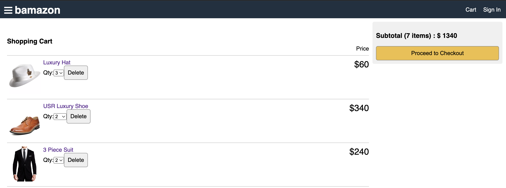

# Bamazon

### This is a MERN stack application (Full Stack)
  - Bamazon is a MERN stack application. It's a demostration of an eCommerce services like Amazon with the client-side rendered in ReactJS and the server-side in NodeJS. The application allows users to select a particular product, and go as far purchasing the product via PayPal, Credit and Debit payments with shipping details. user's also gets the option to sign up, sign in, rate, review with comments which are handled in the backend and saved to the database. Images are uploaded with multer and aws-sdk concepts through thier dependencies

#### Exposures
  - REST
  - Redux
  - React Hooks
  - MongoDB
  - multer
  - multer-s3
  - aws-sdk

#### Displaying the application's home screen

#### Displaying the application's cart total quantity with the total price

